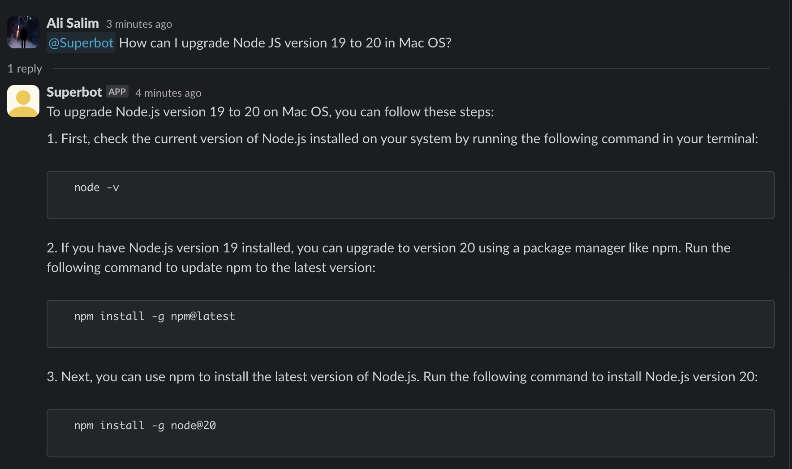

## SuperBot for Slack

This project is a Slack bot that leverages SuperAgent AI. It's built with TypeScript and deployed using AWS lambda functions (you can deploy it to anywhere by building the docker container).



## Deploying (Step-by-step guide)

#### Clone this repository.
```bash
git clone https://github.com/superagent-ai/slack-bot
```

#### Install the dependencies
```bash
npm install
```

#### Copy the .env.example file and rename it to .env:
```bash
cp .env.example .env
```

##### You will need to fill these environment variables
- ```SUPERAGENT_AGENT_ID```: The ID of your Superagent ID or ```SUPERAGENT_WORKFLOW_ID``` The ID of your workflow.
- ```SUPERAGENT_API_BASE_URL```: The base URL for the SuperAgent API.
- ```SLACK_SIGNING_SECRET```: Your Slack app's signing secret.
- ```SLACK_BOT_TOKEN```: Your Slack app's bot token.

#### Superagent environment variables
- Go to [Superagent workflows page](https://beta.superagent.sh/workflows)
- Create your workflow 
- Copy the ID and set ```WORKFLOW_ID``` to that ID.
- Go to [Superagent's API Keys page](https://beta.superagent.sh/settings/api-keys)
- Create a new key & Replace it with ```SUPERAGENT_API_KEY```

#### Slack environment variables
- Go to [Slack API page](https://api.slack.com/apps?new_app=1)
- Click `From an app manifest` button
- Select workspace
- Copy `manifest.yaml` file and paste it to Slack's editor
- Go to `Basic Information` 
- Copy Signing Secret and set `SLACK_SIGNING_SECRET` to that in .env
- Go to `OAuth & Permissions`
- Click `Install to Workspace`
- Copy `User OAuth Token` and set `SLACK_BOT_TOKEN` to that

## Deployment
1. Install serverles
```bash
npm install -g serverless
```

2. Deploy
```bash
serverless deploy
```

3. Setting Events URL in Slack 
- After deploying succesfully, copy the /events endpoint URL
- Scroll to `Event Subscriptions`
- Enable events
- Click to `Subscribe to bot events`
- Add `app_mention`
- Set the Request URL to the lambda URL (e.g. https://example.com/events)
- Go to `Slash commands`
- Click to new command 
- Set command to `/help` and Request URL to the lambda URL that ends with /commands (e.g. https://example.com/commands)


